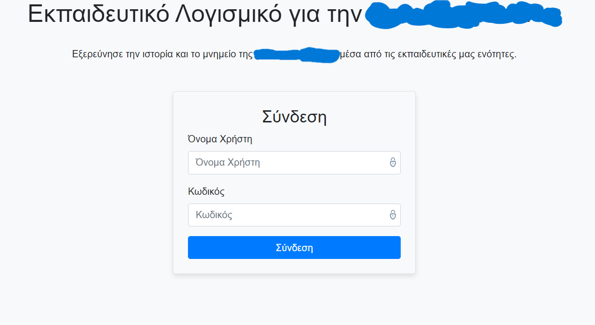
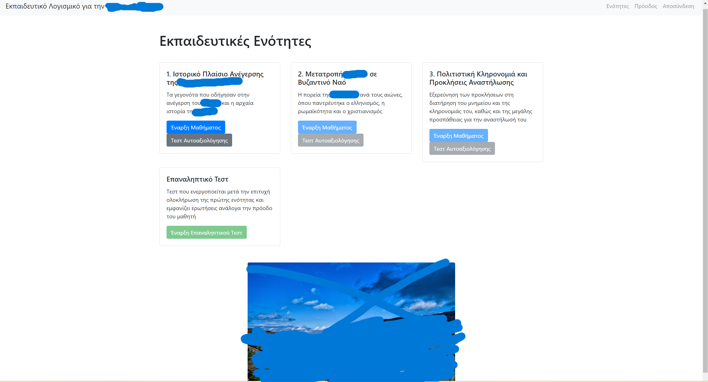
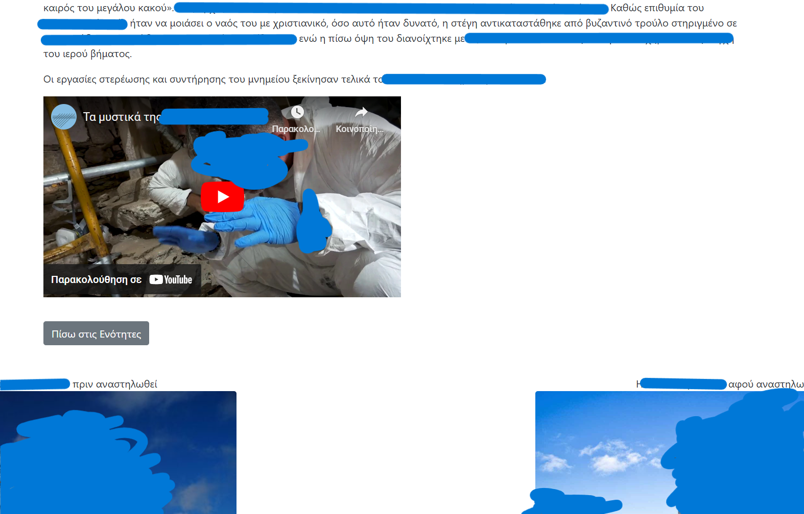
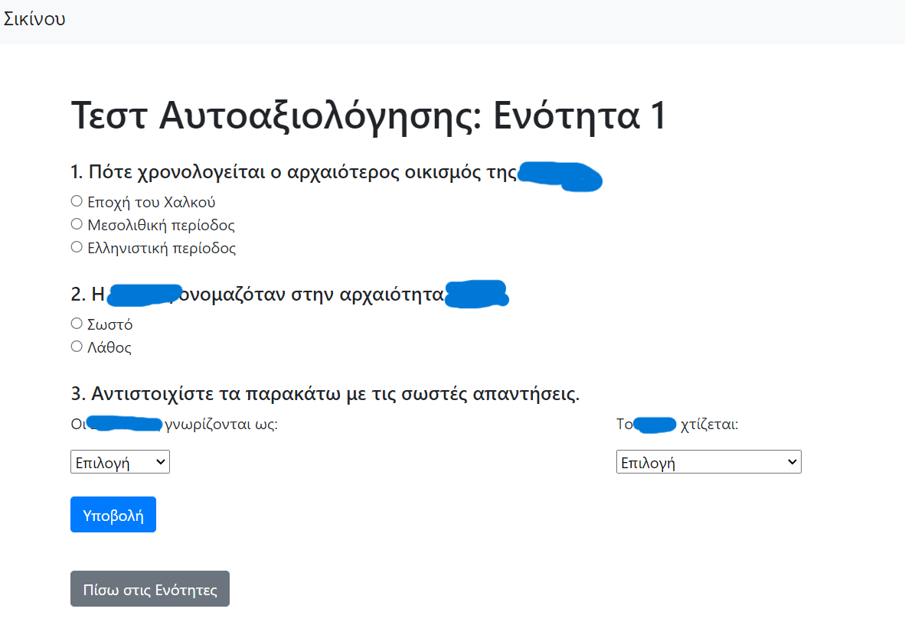
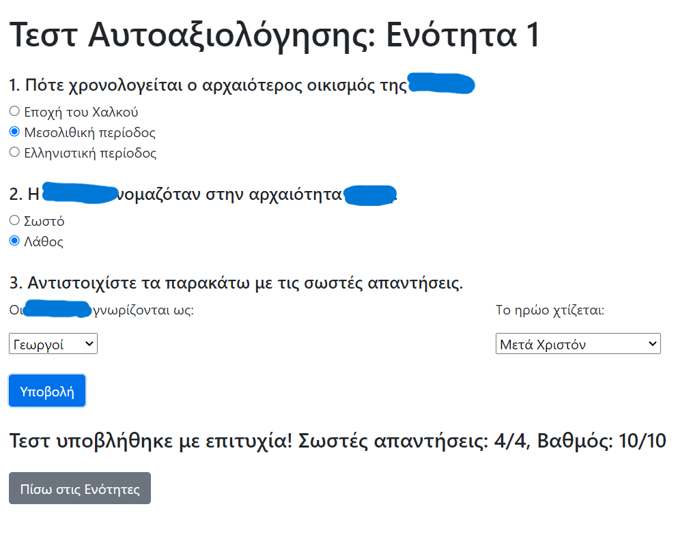
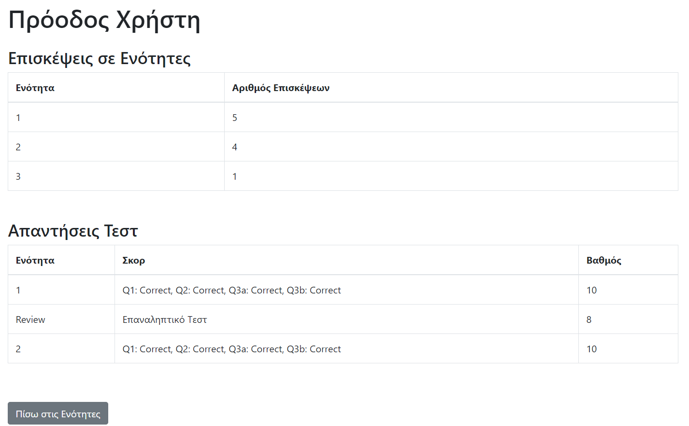
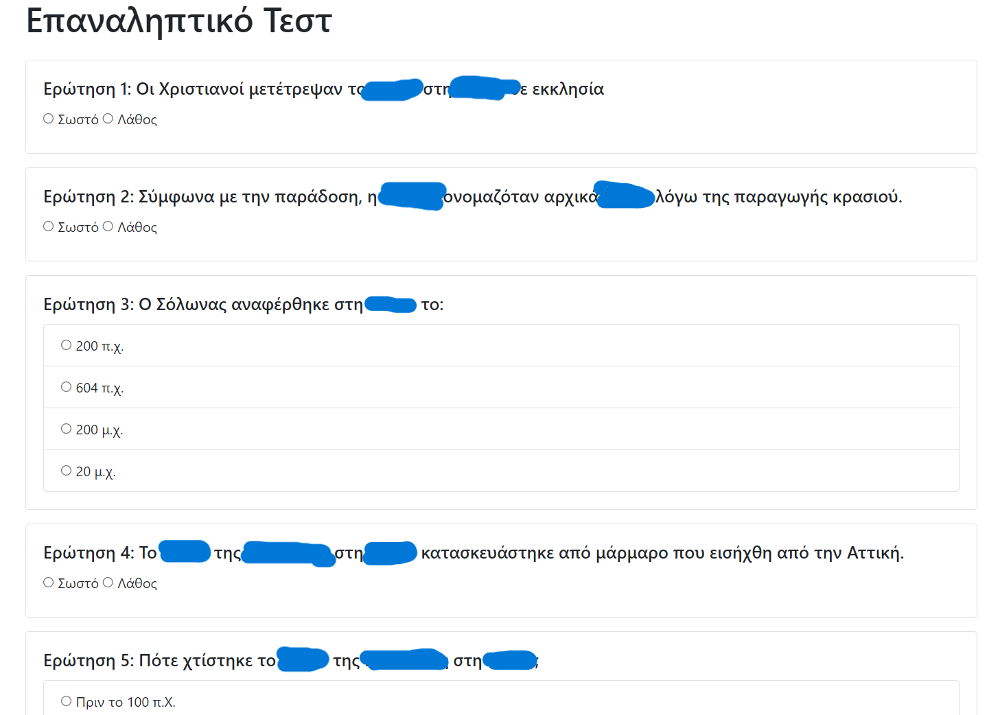
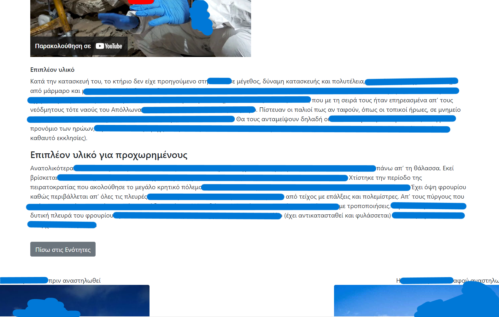

# Adaptive Learning Web App (Node.js + SQLite)


## 📘 About the Project

A modern, full-stack educational web application built with **Node.js**, **Express**, **SQLite**, **JavaScript (ES6+)**, **HTML5**, and **Bootstrap**.
The project demonstrates:

- Adaptive learning logic (personalized learning paths)
- Dynamic test generation with probability-based question selection
- User progress tracking stored in a local SQLite database
- Clean separation of backend routes and frontend static pages
- Fully responsive UI using HTML5 + Bootstrap

Originally created as part of an academic assignment, the project has been refactored and sanitized for public release.
All domain-specific educational content has been replaced with neutral placeholder text, making the repository fully open-source friendly.

---

## 🚀 Features

### **✔ Adaptive Learning System**
- Personalized learning paths based on:
  - Test performance  
  - Frequency of visits per learning unit  
  - Combined behavior metrics  
- Three user levels: **Beginner**, **Intermediate**, **Advanced**  
- Dynamic unlocking of next modules based on success criteria.

### **✔ User Authentication**
- Username/password login  
- Password hashing using **bcrypt**  
- Lightweight user-session handling (localStorage based)

### **✔ Learning Units**
- Three structured educational modules  
- Each module contains:
  - Text content  
  - Images, rich media, embedded PDFs, and YouTube videos  
  - Dynamic elements based on the user's difficulty level

### **✔ Test Engine**
- Unit tests with static questions  
- Review test with dynamically generated questions from SQLite  
- Weighted question selection based on user weaknesses  
- Automatic grading  
- Persistent storage of test scores and responses

### **✔ User Progress Dashboard**
- Displays:
  - All previous test attempts for review tests  
  - Modules visit counter 
  - Limited number of test attempts for each unit test
- Results ordered chronologically based on actual usage

---

## 🏗 Tech Stack

### **Backend**
- Node.js  
- Express.js  
- SQLite (sqlite3 package)  
- bcrypt (password hashing)

### **Frontend**
- HTML5  
- Vanilla JavaScript  
- Bootstrap CSS  
- Embedded media (PDFs, YouTube, images)

### **Database**
- SQLite file-based DB  
- Automatic schema creation on first run  
- Optional seeding via `seed.js`

---

## 📁 Project Structure

```
project/
│
├── server.js             # Express server and routes
│
├── config/               
│   ├── db.js                 # SQLite schema + database connection
│   ├── seed.js               # Optional placeholder data seeding
│   └── user_progress.db   # (auto-generated at runtime, ignored in Git)
│
├── routes/               # Express route handlers
│   ├── learningpaths.js
│   ├── modules.js
│   ├── progress.js
│   ├── reviewTest.js
│   └── tests.js
│
├── public/               # Static frontend files
│   ├── index.html
│   ├── modules.html
│   ├── lesson1.html
│   ├── lesson2.html
│   ├── lesson3.html
│   ├── progress.html
│   ├── reviewtest.html
│   ├── test1.html
│   ├── test2.html
│   ├── test3.html
│   ├── files/
│   └── images/
│
├── README.md             # You are here
├── package.json
├── package-lock.json
├── screenshots/
└── .gitignore
# node_modules/ (generated automatically, ignored)
```

---

## 🛠 Installation

### 1. Clone the Repository
```bash
git clone https://github.com/kon-f/Adaptive_Learning_Web_App.git
cd your-repo-name
```

### 2. Install Dependencies
```bash
npm install
```

### 3. (Optional) Seed Placeholder Data
If you want demo users and test questions:

```bash
node config/seed.js
```

### 4. Run the Server
```bash
node server.js
```

Then open your browser at:

👉 **http://localhost:3000**

---

## 🔐 Default Demo Users

The optional `seed.js` script creates:

| Username    | Password      |
|-------------|---------------|
| demo_user1  | password123   |
| demo_user2  | password123   |

---

## 🧪 Adaptive Logic Overview

### Module Unlocking
A unit unlocks automatically when:
- The previous unit test score ≥ **5/10**

### Review Test Question Selection
- Questions are fetched dynamically from SQLite  
- Weighted random selection:
  - Weak units = 3× probability  
  - Average units = 2×  
  - Strong units = 1×  

### Level Calculation
Based on:
- Test score  
- Number of revisits to a unit  

Levels:
- **Beginner**
- **Intermediate**
- **Advanced**

These influence the content displayed in the next module.

---

## 📸 Screenshots

<div style="
  display: flex;
  flex-wrap: wrap;
  gap: 20px;
  justify-content: center;
">

  <!-- 1 -->
  <div style="
    flex: 1 1 calc(33% - 20px);
    min-width: 280px;
    max-width: 420px;
  ">
    <p style="text-align:center; font-weight:600;">Login Page</p>
    
  </div>

  <!-- 2 -->
  <div style="
    flex: 1 1 calc(33% - 20px);
    min-width: 280px;
    max-width: 420px;
  ">
    <p style="text-align:center; font-weight:600;">Units Overview</p>
    
  </div>

  <!-- 3 -->
  <div style="
    flex: 1 1 calc(33% - 20px);
    min-width: 280px;
    max-width: 420px;
  ">
    <p style="text-align:center; font-weight:600;">Lesson with YouTube Embed</p>
    
  </div>

  <!-- 4 -->
  <div style="
    flex: 1 1 calc(33% - 20px);
    min-width: 280px;
    max-width: 420px;
  ">
    <p style="text-align:center; font-weight:600;">Unit Test – Before Submit</p>
    
  </div>

  <!-- 5 -->
  <div style="
    flex: 1 1 calc(33% - 20px);
    min-width: 280px;
    max-width: 420px;
  ">
    <p style="text-align:center; font-weight:600;">Unit Test – After Submit</p>
    
  </div>

  <!-- 6 -->
  <div style="
    flex: 1 1 calc(33% - 20px);
    min-width: 280px;
    max-width: 420px;
  ">
    <p style="text-align:center; font-weight:600;">User Progress Dashboard</p>
    
  </div>

  <!-- 7 -->
  <div style="
    flex: 1 1 calc(33% - 20px);
    min-width: 280px;
    max-width: 420px;
  ">
    <p style="text-align:center; font-weight:600;">Review Test (Dynamic Questions)</p>
    
  </div>

  <!-- 8 -->
  <div style="
    flex: 1 1 calc(33% - 20px);
    min-width: 280px;
    max-width: 420px;
  ">
    <p style="text-align:center; font-weight:600;">Adaptive Learning – Advanced Material</p>
    
  </div>

</div>

---

## 📜 License

This project is licensed under the **MIT License**.  
You may modify, distribute, and use it freely.

---

## 🙌 Acknowledgements

Original inspiration came from an academic assignment on developing educational software with adaptive learning paths and progress tracking.  
This repository version contains **safe generic content only** and is intended for portfolio use.

---

Happy coding!
